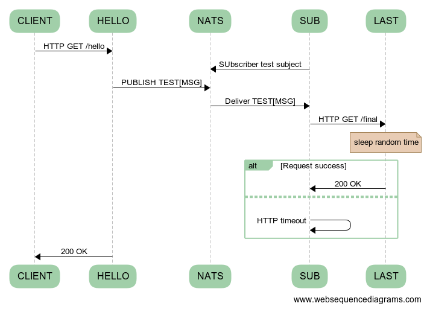

# Open telemetry tracing across http and nats

## RUN 
### Start solution
```bash
docker compose up 
```

### Jaeger
available at http://localhost:16686

### Perform some calls
```bash
curl -X GET localhost:8080/hello
```

## Flows
### Normal Flow


## Otel Flow 

